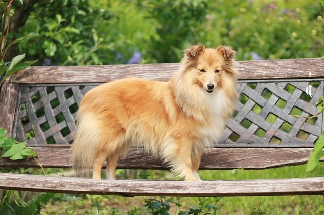

# AI画像分類 入門（Google Colab版）

この教材では、Google Colabを利用して、環境構築なしで画像分類AIを作成できます。

## 動作環境

* Googleアカウント
* Google Chrome、Microsoft EdgeなどのWebブラウザ
* インターネット接続

ソフトウェアのインストールは不要です。

---

# 1. Google Colabで開く

GitHub上のノートブック（`.ipynb`）を開きます。

次のいずれかの方法で実行してください。

## 方法1（おすすめ）

GitHubのノートブック画面で **「Open in Colab」** バッジがある場合はクリックします。

## 方法2

1. Google Colabを開く

   * https://colab.research.google.com/

2. **GitHub** タブを選択

3. このリポジトリのURLを入力、または検索

4. 対象の `.ipynb` を開く

---

# 2. 自分のGoogle Driveへコピー

開いたノートブックは編集せず、必ずコピーを作成してください。

**ファイル → ドライブにコピーを保存**

以降はコピーしたノートブックを使用します。

---

# 3. ランタイムを接続

画面右上の **「接続」** をクリックします。

初回は数十秒ほどかかる場合があります。

---

# 4. GPUを有効にする（推奨）

**ランタイム → ランタイムのタイプを変更**

以下を設定してください。

* ハードウェア アクセラレータ：**T4 GPU（利用可能な場合）**

GPUが利用できない場合でもCPUで実行できますが、学習時間が長くなることがあります。

---

# 5. ノートブックを上から順番に実行

セルは必ず上から順番に実行してください。

実行順序は次のとおりです。

1. 初期設定
2. クラス1の画像をアップロード
3. クラス2の画像をアップロード
4. データ確認
5. AIモデルを作成
6. 学習開始
7. 学習結果の確認
8. 判定画像をアップロード

---

# 6. 学習用画像を準備

2つのクラスについて画像を用意してください。
データがない場合はレポジトリに用意してある画像を使用してください


推奨枚数

* 各クラス10〜50枚程度

画像が多いほど、精度が向上する可能性があります。

---

# 7. 判定

学習完了後、判定したい画像をアップロードすると、AIが分類結果と信頼度を表示します。

- 例



```bash
判定結果: Dog
信頼度: 89.41%

詳細:
Cat: 10.59%
Dog: 89.41%
```

---

# よくある質問

## 画像が0枚と表示されます

クラス1・クラス2の画像アップロードセルを実行しているか確認してください。

---

## 学習できません

セルは上から順番に実行してください。

途中のセルを飛ばすとエラーになる場合があります。

---

## GPUが選択できません

Google Colabの利用状況によってはGPUが利用できない場合があります。

その場合はCPUで実行できますが、学習時間が長くなることがあります。

---

# ライセンス

本教材は学習目的で作成されています。
必要に応じて改変・拡張してご利用ください。
